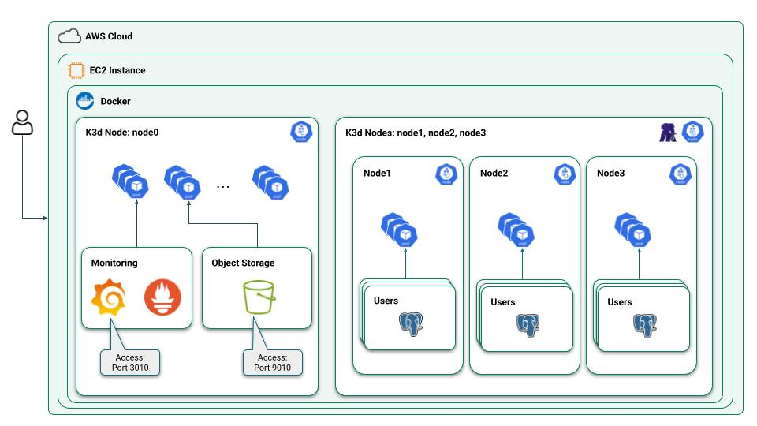
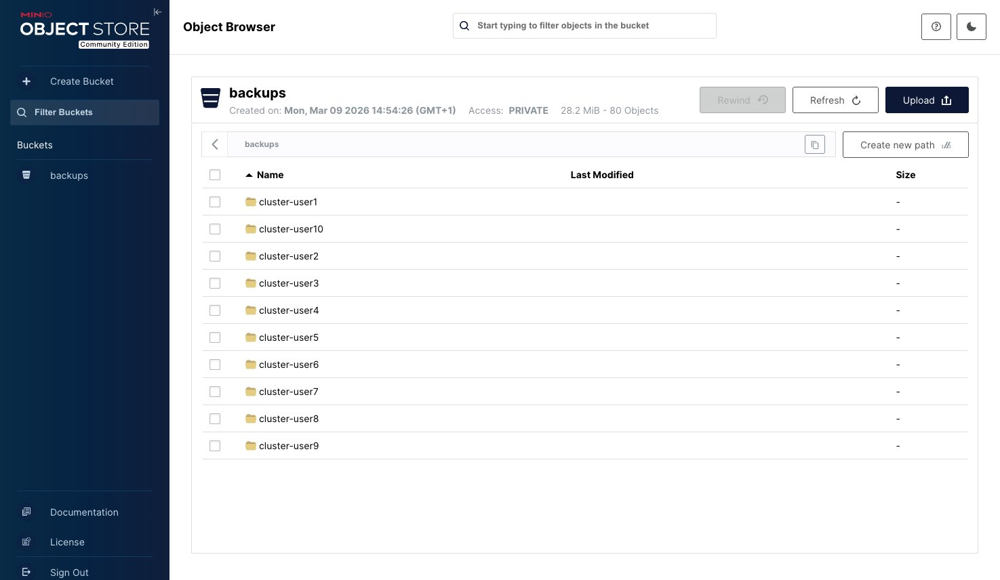
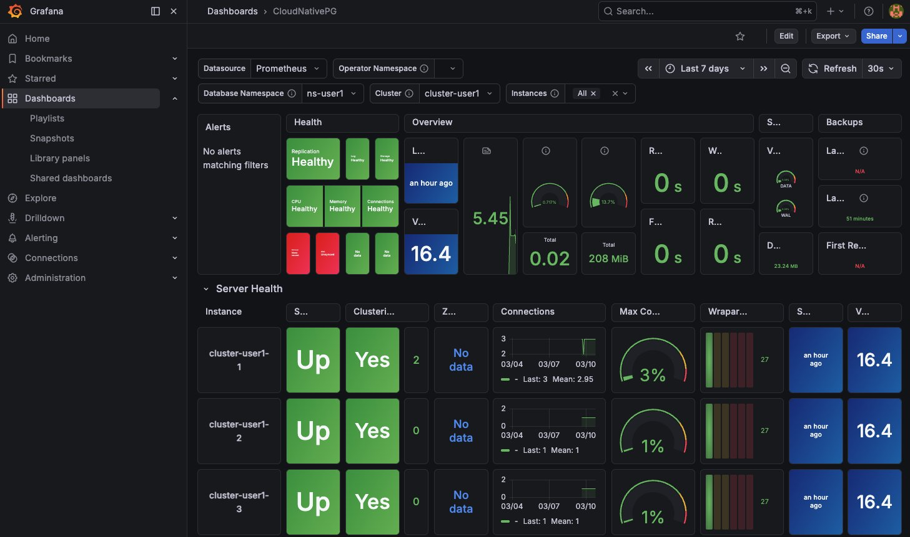

# Workshop: CloudNativePG Demo on EC2 (k3d + Docker)

This repository demonstrates how to run and operate a **PostgreSQL high-availability cluster on Kubernetes** using **CloudNativePG / EDB Postgres for Kubernetes Operator**.

The demo environment runs on:

- **AWS EC2**
- **Docker**
- **k3d (K3s in Docker)**
- **MinIO (S3 compatible storage)** for backups

It walks through common **Day-1 and Day-2 operations** for PostgreSQL in Kubernetes.
This demos have been built to run in a multiuser linux environment.

---

# Architecture
```
EC2 Instance
│
├─ Docker
│
├─ k3d Kubernetes cluster
│   │
│   ├─ CloudNativePG / EDB Postgres for Kubernetes Operator
│   ├─ MinIO (S3 Compatible Object Storage)
│   └─ Grafana/Prometheus
│
├─ User1
│   └─ PostgreSQL Cluster
│       ├─ Primary
│       ├─ Replica 1
│       └─ Replica 2
...
├─ UserN
│   └─ PostgreSQL Cluster
│       ├─ Primary
│       ├─ Replica 1
│       └─ Replica 2
```


# Features Demonstrated

This repository demonstrates the following operational capabilities:

| Feature | Description |
|------|------|
| Kubernetes Plugin Install | Install `kubectl-cnpg` plugins for PostgreSQL cluster management |
| Operator Install | Deploy **CloudNativePG operator** |
| PostgreSQL Cluster Deployment | Create a highly available PostgreSQL cluster |
| Insert Data | Demonstrate workload operations |
| Switchover | Promote a replica manually |
| Failover | Automatic promotion when primary fails |
| Backup | Backup cluster to **MinIO S3 storage** |
| Recovery | Restore cluster from backup |
| Scaling | Scale replicas up and down |
| Rolling Updates | Minor and major PostgreSQL upgrades |
| Fencing | Isolate a node to prevent split brain |
| Monitoring | Use Grafana to monitor cluster health |
| Operator Upgrade | Upgrade Kubernetes operator |

# Prerequisites
This workshop needs an AWS EC2 instance with this configuration:
- CPUs: Minimum 8 cpu's
- RAM: 32GB
- Storage:
  - 4 disks with this configuration:
  - Type: gp3
  - IOPS: 6000
  - Throughput: 300
- lsblk:
  - xvda: 50GB
  - xvdb: 50GB
  - xvdc: 50GB
  - xvdd: 50GB

## Security groups
To be able to access to the EC2 VM, Grafana and Minio, it is necessary to create some security group rules:
- SSH
  - Type: SSH
  - Port: 22
- Grafana
  - Protocol: Custom TCP
  - Port: 3010
- Minio
  - Type: Custom TCP
  - Port: 9010


# Installation
Install main components:
- Docker
- k3d
- kubectl
- helm

And other software:
-  bat
- htop
- cmclt
- rich

With ec2-user:
```
cd workshop-k8s/admin/
./install_EC2.sh
```
## Install minio
Execute:
```
cd ~/workshop-k8s/admin/minio
install_minio.sh
```
After installation, you can access to MinIO with:
- User: `admin`
- Password: `password`
- URL: `http://<ec2_public_ip>:9010/`


## Install Prometheus and Grafana
Execute:
```
cd ~/workshop-k8s/admin/prometheus
./install_prometheus.sh
```
After installation, you can access to MinIO with:
- User: `admin`
- Password: `prom-operator`
- URL: http://<ec2_public_ip>:3010/login

Install CloudNativePG dashboard:
- In Grafana, go to Dashboard -> New -> Import
- Import this [CloudnativePG Grafana dashboard file](https://github.com/cloudnative-pg/grafana-dashboards/blob/main/charts/cluster/grafana-dashboard.json)
- Load dashboard

A new dashboard CloudNativePG is loaded.



## Install Shellinabox
Shell In A Box implements a web server that can export arbitrary command line tools to a web based terminal emulator. This emulator is accessible to any JavaScript and CSS enabled web browser and does not require any additional browser plugins.
```
./install_shellinabox.sh
```

## Create linux users
By default, 10 users are created in the Linux VM. The file `config.sh` contain the configuration:
```
cd ~/workshop-k8s/admin/
./create_linux_users.sh
```


